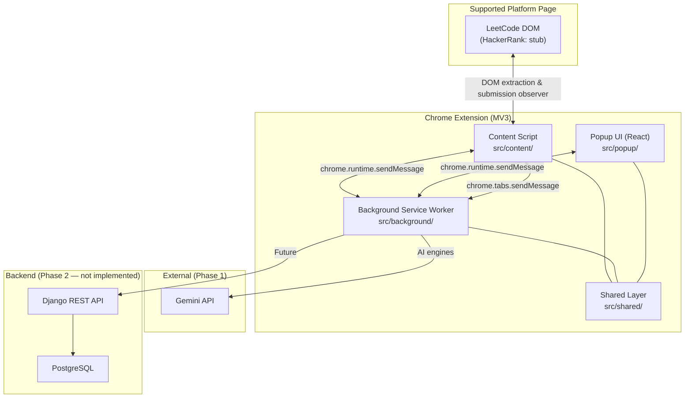

# Architecture

**Coding Interview Coach** (Interview Forge) is a Chrome Extension (Manifest V3) built with React, TypeScript, Vite, and Tailwind CSS.

This document is the **technical architecture guide**: folder layout, runtime layers, message contracts, storage, and AI orchestration. For a product-level inventory of what the extension does today, see [FEATURES.md](./FEATURES.md).

---

## High-Level Overview



### Design Principles

| Layer | Responsibility | Must not |
|-------|----------------|----------|
| **Content Script** | Platform detection, DOM extraction, submission observation | Call AI APIs, own business rules |
| **Background** | Message routing, AI orchestration, storage, context menus | Access DOM |
| **Popup** | React presentation, user interaction | Contain business logic (delegates via messages) |
| **Shared** | Types, messaging, domain services, storage | Import DOM APIs |

Business logic lives in `src/shared/domain/` and `src/background/ai/`. React components call `sendMessage()` and render responses.

---

## Folder Structure

```
interview-forge/
├── public/
│   └── icons/                          # Extension icons (16, 32, 48, 128 px)
├── src/
│   ├── manifest.json                   # Chrome MV3 manifest (source of truth)
│   │
│   ├── background/                     # Service worker — orchestration
│   │   ├── service-worker.ts           # Entry: imports handlers, init context menus
│   │   ├── context-menu.ts             # Right-click "Get Hint" / "Review Code"
│   │   ├── handlers/                   # One file per message type group
│   │   │   ├── get-problem-context.ts
│   │   │   ├── generate-hints.ts
│   │   │   ├── translate-problem.ts
│   │   │   ├── analyze-solution.ts
│   │   │   ├── persistence.ts
│   │   │   └── context-menu.ts
│   │   └── ai/                         # AI provider + engines
│   │       ├── providers/              # Gemini client
│   │       ├── hint-engine/            # Progressive hints + guardrails
│   │       ├── solution-engine/        # Code review & submission analysis
│   │       └── translation-engine/     # Problem description translation
│   │
│   ├── content/                        # Injected into platform pages
│   │   ├── index.ts                    # Entry: platform detection, message listener
│   │   ├── messaging.ts                # Content-side message handlers
│   │   ├── extract-problem-context.ts  # Platform router for extraction
│   │   └── platforms/
│   │       ├── index.ts                # detectPlatform()
│   │       ├── leetcode/               # Full adapter (extraction + submission observer)
│   │       └── hackerrank.ts           # Stub (M8)
│   │
│   ├── popup/                          # React UI (toolbar popup)
│   │   ├── index.html
│   │   ├── main.tsx
│   │   ├── App.tsx                     # Root layout & data fetching
│   │   ├── styles.css                  # Tailwind + base styles
│   │   ├── components/                 # UI panels
│   │   │   ├── AppHeader.tsx
│   │   │   ├── ProblemHubPanel.tsx     # Problem summary + recent problems
│   │   │   ├── CoachPanel.tsx          # Hints + solution review (main coach UI)
│   │   │   ├── PersistencePanel.tsx    # Saved problems + learning profile
│   │   │   ├── StickyActionBar.tsx
│   │   │   └── ...
│   │   ├── hooks/                      # useTranslation, usePersistence, useSolutionAnalysis
│   │   └── locales/                    # en.ts, vi.ts
│   │
│   └── shared/                         # Shared across all extension contexts
│       ├── types/                      # TypeScript contracts + message union
│       ├── messaging/                  # sendMessage, router, sendTabMessage
│       ├── domain/                     # Business logic (history, hints, profile, …)
│       ├── storage/                    # Versioned chrome.storage.local wrapper
│       ├── cache/                      # TTL caches (translation, hints, solutions)
│       ├── constants/                  # Storage keys, platform URLs
│       └── utils/
│
├── ARCHITECTURE.md                     # This file
├── FEATURES.md                         # Product feature inventory
├── package.json
├── vite.config.ts
└── .env.example
```

---

## Runtime Layers (MV3)

| Layer | Entry | Responsibility |
|-------|-------|----------------|
| **Content Script** | `src/content/index.ts` | Detect platform, extract `ProblemContext`, observe LeetCode submissions, extract editor code for analysis |
| **Background Service Worker** | `src/background/service-worker.ts` | Route typed messages, run AI engines, persist data, manage context menus and badge |
| **Popup UI** | `src/popup/main.tsx` | React interface: problem hub, coach panel, persistence panel |
| **Shared** | `src/shared/` | Types, messaging router, domain services, storage. Must stay DOM-free |

---

## Message Flow

All cross-context communication uses a discriminated union in `src/shared/types/messages.ts`. Handlers register via `registerHandler()` in `src/shared/messaging/router.ts`.

### Problem context

```
Popup                    Background                 Content Script
  │                          │                           │
  │  GET_PROBLEM_CONTEXT     │                           │
  ├─────────────────────────►│                           │
  │                          │  GET_PROBLEM_CONTEXT      │
  │                          ├──────────────────────────►│
  │                          │◄──────────────────────────┤
  │                          │  { ok, data: ProblemContext }
  │                          │  → addRecentProblem()     │
  │◄─────────────────────────┤                           │
  │  { ok, data }            │                           │
```

### AI features (hints, translation, solution analysis)

```
Popup  ──►  Background (AI engine + cache)  ──►  Popup
                │
                └──► Gemini API (Phase 1)
```

### Auto-analyze on submit (LeetCode)

```
Content Script                Background
  │  SUBMISSION_DETECTED         │
  ├─────────────────────────────►│  (if autoAnalyzeOnSubmit)
  │                              │  → SolutionAnalysisEngine
  │                              │  → saveSolutionAnalysis()
  │                              │  → set badge "!"
```

### Message types (current)

| Type | Direction | Handler |
|------|-----------|---------|
| `PING` | Any → BG / CS | Health check |
| `GET_PROBLEM_CONTEXT` | Popup → BG → CS | Extract current problem |
| `GET_ANALYSIS_CONTEXT` | BG → CS | Problem + editor code |
| `GENERATE_HINTS` | Popup → BG | Hint engine + ladder cache |
| `TRANSLATE_PROBLEM` | Popup → BG | Translation engine + cache |
| `ANALYZE_SOLUTION` | Popup → BG | Manual code review |
| `GET_SOLUTION_ANALYSIS` | Popup → BG | Load latest cached analysis |
| `SUBMISSION_DETECTED` | CS → BG | Auto-analyze after submit |
| `GET/SET_ANALYSIS_SETTINGS` | Popup → BG | Auto-analyze toggle |
| `GET_RECENT_PROBLEMS` | Popup → BG | Problem history |
| `GET_SAVED_PROBLEMS` / `SAVE_PROBLEM` / `UNSAVE_PROBLEM` | Popup → BG | Bookmarks |
| `GET/UPDATE_HINT_SESSION` | Popup → BG | Progressive hint state |
| `GET_LEARNING_PROFILE` | Popup → BG | Local analytics |
| `REFRESH_CONTEXT_MENUS` | Popup → BG | Rebuild context menu labels |

---

## AI Layer

Three singleton engines in `src/background/ai/`, each backed by a shared Gemini provider (`createAiProvider()`). Returns `null` when `VITE_GEMINI_API_KEY` is not set.

| Engine | Module | Purpose |
|--------|--------|---------|
| **HintEngine** | `hint-engine/` | Progressive hints (batch of 3, max 8), pattern/difficulty meta, guardrails against solution leaks |
| **SolutionAnalysisEngine** | `solution-engine/` | Manual review + submission-aware feedback (pattern, complexity, bottlenecks, edge cases) |
| **TranslationEngine** | `translation-engine/` | Translate problem description to Vietnamese |

Engines return typed `Result` objects (`success` / `error`). Handlers map errors to `ExtensionResponse`.

---

## Domain Layer

`src/shared/domain/` holds local-first business logic. Background handlers call these services; popup never imports them directly.

| Service | File | Responsibility |
|---------|------|----------------|
| History | `history.service.ts` | Recent problems (dedupe by `problemId`, max 3) |
| Saved problems | `saved-problems.service.ts` | Bookmark / unbookmark |
| Hint sessions | `hint-session.service.ts` | Per-problem hint progress (`currentLevel`, hint buffer) |
| Learning profile | `learning-profile.service.ts` | Counters: viewed problems, hints requested, pattern frequency |
| Analysis settings | `analysis-settings.service.ts` | `autoAnalyzeOnSubmit` preference |

---

## Storage & Caching

### Storage service

`src/shared/storage/storage.service.ts` wraps `chrome.storage.local` with versioned records and optional TTL:

```typescript
interface StorageRecord<T> {
  version: number;
  expiresAt?: number;
  data: T;
}
```

### Cache service

`src/shared/cache/cache.service.ts` manages TTL-backed AI result caches. Keys are defined in `src/shared/constants/storage-keys.ts`.

| Cache | Key pattern | TTL |
|-------|-------------|-----|
| Translation | `if:translation:{problemId}:{locale}` | 30 days |
| Hint ladder | `if:hint_ladder:{problemId}:{locale}` | 30 days |
| Solution analysis | `if:solution:{problemId}:{codeHash}` | 48 hours |
| Submission analysis | `if:solution:{problemId}:{codeHash}:submission:{verdict}` | 48 hours |

Persistent (no TTL) data: recent problems, saved problems, hint sessions, learning profile, analysis settings.

### Session storage

`chrome.storage.session` stores `PENDING_COACH_ACTION_KEY` when the user triggers "Get Hint" or "Review Code" from the context menu before the popup opens.

---

## Platform Adapter Pattern

Each platform lives under `src/content/platforms/`. Popup and background never import platform-specific code.

| Platform | Status | Capabilities |
|----------|--------|--------------|
| **LeetCode** | Implemented | Title, description, examples, constraints, difficulty, `problemId`, submission observer, editor code extraction |
| **HackerRank** | Stub (`hackerrank.ts`) | Detection only; extraction not implemented |

Adding a platform means:

1. Create adapter under `src/content/platforms/`
2. Register in `detectPlatform()` router
3. Add `host_permissions` and `content_scripts.matches` in `manifest.json`

---

## Popup Composition

`App.tsx` orchestrates the popup layout:

```
AppHeader (locale switcher)
  └── ProblemHubPanel (problem summary, save, recent problems)
  └── PersistencePanel (saved problems, learning profile)
  └── CoachPanel (hints, pattern meta, solution review)
  └── StickyActionBar (quick "Get Hint" when scrolled)
```

Legacy stub components (`PatternPanel`, `ComplexityPanel`, `ExplainPanel`) exist but are not wired into `App.tsx`. Their functionality is consolidated in `CoachPanel`.

---

## Context Menu Integration

`src/background/context-menu.ts` registers a LeetCode-only context menu:

- **Interview Forge → Get Hint** — stores pending action, opens popup
- **Interview Forge → Review Code** — stores pending action, opens popup

Menu labels follow the user's locale (`en` / `vi`). `CoachPanel` consumes the pending action on popup mount.

---

## Build Tooling

| Tool | Role |
|------|------|
| **Vite** | Dev server and production bundler |
| **@crxjs/vite-plugin** | MV3 multi-entry bundling + HMR |
| **@vitejs/plugin-react** | JSX/TSX for popup |
| **TypeScript** | Strict typing across all contexts |
| **Tailwind CSS** | Popup styling |

### Scripts

```bash
npm run dev      # Vite dev server with extension HMR (port 5173)
npm run build    # Type-check and produce dist/
```

Load unpacked from `dist/` in `chrome://extensions`.

### Environment variables

```
VITE_GEMINI_API_KEY=...
VITE_GEMINI_MODEL=gemini-2.5-flash
```

Rebuild after changing `.env`. Keys are bundled at build time (Phase 1 only).

---

## Security & Permissions

| Permission | Purpose |
|------------|---------|
| `storage` | Persist caches, history, profile, settings |
| `activeTab` | Access current tab from popup |
| `scripting` | Programmatic content script injection (if needed) |
| `contextMenus` | Right-click coach actions on LeetCode |
| `host_permissions` | LeetCode, HackerRank, Gemini API, dev HMR |

API keys live in `.env` during Phase 1 development. Phase 2 moves AI calls and secrets to a backend.

---

## Phase 2 Backend (Future)

Not implemented. When added, `backend/` will sit alongside the extension:

```
interview-forge/
├── src/          # Extension (unchanged structure)
└── backend/      # Django + DRF + PostgreSQL
```

The background AI layer will switch from direct Gemini calls to authenticated REST calls against the backend.

---

## Related Docs

| File | Purpose |
|------|---------|
| [FEATURES.md](./FEATURES.md) | What the extension does today (product inventory) |
| [README.md](./README.md) | Getting started and load instructions |
