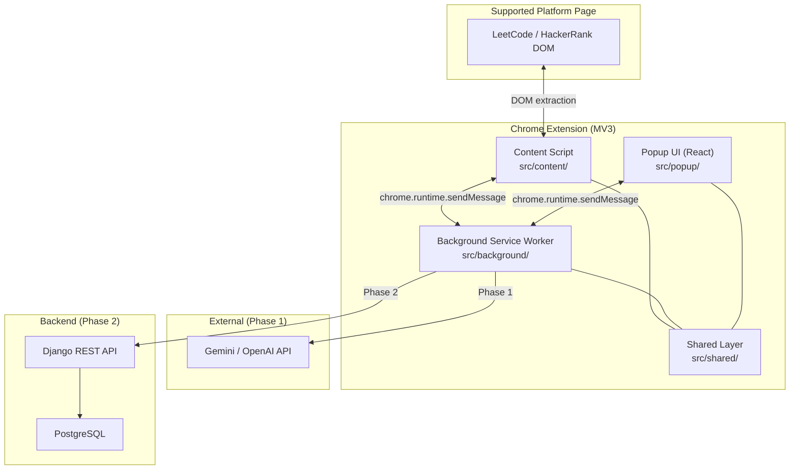

# Architecture

Coding Interview Coach is a Chrome Extension (Manifest V3) built with React, TypeScript, Vite, and Tailwind CSS. This document describes the folder structure, runtime layers, and communication flow. No MVP features are implemented yet.

---

## High-Level Overview



---

## Folder Structure

```
interview-forge/
├── public/
│   └── icons/                  # Extension icons (16, 48, 128 px)
├── src/
│   ├── manifest.json           # Chrome MV3 manifest (source of truth)
│   │
│   ├── background/             # Service worker — long-lived orchestration
│   │   ├── service-worker.ts   # Entry: message listener, lifecycle hooks
│   │   ├── handlers/           # Route messages to feature handlers (M2+)
│   │   └── ai/                 # AI provider clients & prompts (M2+)
│   │
│   ├── content/                # Injected into platform pages
│   │   ├── index.ts            # Entry: platform detection, extraction trigger
│   │   └── platforms/          # Per-platform DOM adapters
│   │       ├── index.ts        # Platform router (detectPlatform)
│   │       ├── leetcode.ts     # LeetCode adapter (M1)
│   │       └── hackerrank.ts   # HackerRank adapter (M8)
│   │
│   ├── popup/                  # React UI opened from toolbar icon
│   │   ├── index.html          # Popup HTML shell
│   │   ├── main.tsx            # React entry
│   │   ├── App.tsx             # Root layout
│   │   ├── styles.css          # Tailwind directives + base styles
│   │   └── components/         # Feature panels (stubs until M3–M7)
│   │       ├── HintPanel.tsx
│   │       ├── PatternPanel.tsx
│   │       ├── ComplexityPanel.tsx
│   │       ├── ExplainPanel.tsx
│   │       └── ProblemHeader.tsx
│   │
│   └── shared/                 # Code shared across all extension contexts
│       ├── types/              # TypeScript contracts
│       │   ├── problem-context.ts
│       │   ├── messages.ts
│       │   └── index.ts
│       ├── messaging/          # Typed message passing
│       │   ├── send-message.ts
│       │   ├── router.ts
│       │   └── index.ts
│       ├── constants/
│       └── utils/
│
├── ARCHITECTURE.md             # This file
├── PRD.md                      # Product requirements
├── package.json
├── vite.config.ts              # Vite + @crxjs/vite-plugin
├── tsconfig.json
├── tailwind.config.js
├── postcss.config.js
└── .env.example                # API keys (dev only, Phase 1)
```

---

## Runtime Layers (MV3)

| Layer | File | Responsibility |
|-------|------|----------------|
| **Content Script** | `src/content/` | Runs in page context. Detects platform, extracts problem DOM, responds to context requests. |
| **Background Service Worker** | `src/background/` | Stateless orchestrator. Routes messages, calls AI APIs, manages storage. No DOM access. |
| **Popup UI** | `src/popup/` | React + Tailwind interface. Displays problem summary and feature panels. Talks to background via messages. |
| **Shared** | `src/shared/` | Types, messaging utilities, constants. Imported by all three contexts. Must stay DOM-free. |

---

## Message Flow

All cross-context communication uses typed messages defined in `src/shared/types/messages.ts`.

```
Popup                    Background                 Content Script
  │                          │                           │
  │  GET_PROBLEM_CONTEXT     │                           │
  ├─────────────────────────►│                           │
  │                          │  GET_PROBLEM_CONTEXT      │
  │                          ├──────────────────────────►│
  │                          │◄──────────────────────────┤
  │                          │  PROBLEM_CONTEXT          │
  │◄─────────────────────────┤                           │
  │  { ok, data }            │                           │
```

Future AI feature messages (M2+) will follow the same pattern:

```
Popup  ──►  Background (AI call)  ──►  Popup
                │
                └──► Gemini / OpenAI (Phase 1)
                └──► Django API     (Phase 2)
```

---

## Build Tooling

| Tool | Role |
|------|------|
| **Vite** | Dev server and production bundler |
| **@crxjs/vite-plugin** | Bridges Vite with Chrome Extension MV3 (HMR, multi-entry) |
| **@vitejs/plugin-react** | JSX/TSX support for popup |
| **TypeScript** | Strict typing across all contexts |
| **Tailwind CSS** | Utility-first styling for popup UI |

### Scripts

```bash
npm run dev      # Start Vite dev server with extension HMR
npm run build    # Type-check and produce dist/ for loading in Chrome
```

Load unpacked extension from the `dist/` directory after building (or the dev output path shown by `@crxjs/vite-plugin` during `npm run dev`).

---

## Shared Type Contracts

### `ProblemContext`

Normalized problem data extracted from any supported platform:

```typescript
interface ProblemContext {
  platform: "leetcode" | "hackerrank";
  url: string;
  title: string;
  description: string;
  examples: ProblemExample[];
  constraints?: string[];
  extractedAt: string;
}
```

### `ExtensionMessage`

Discriminated union for all extension messages. Extend this as features are added:

```typescript
type ExtensionMessage =
  | { type: "PING" }
  | { type: "GET_PROBLEM_CONTEXT" }
  | { type: "PROBLEM_CONTEXT"; payload: ProblemContext | null };
```

---

## Platform Adapter Pattern

Each coding platform gets an isolated adapter under `src/content/platforms/`:

1. **`detectPlatform(url)`** — returns platform ID or `null`
2. **`extractProblemContext(document)`** — returns `ProblemContext` (M1/M8)
3. Adapters are wired in `src/content/index.ts`; popup and background never import platform-specific code

Adding Codeforces (future) means adding `codeforces.ts` and updating the router — no changes to popup or background.

---

## Feature Ownership Map

| Milestone | Directory | Files |
|-----------|-----------|-------|
| M1 Problem Detection | `src/content/platforms/` | `leetcode.ts` |
| M2 AI Integration | `src/background/ai/` | provider clients, prompts |
| M2 Message Handlers | `src/background/handlers/` | feature routing |
| M3 Hint Generator | `src/popup/components/HintPanel.tsx` | + background handler |
| M4 Pattern Detection | `src/popup/components/PatternPanel.tsx` | + background handler |
| M5 Complexity Analyzer | `src/popup/components/ComplexityPanel.tsx` | + background handler |
| M6 Explain Solution | `src/popup/components/ExplainPanel.tsx` | + background handler |
| M7 Popup UX | `src/popup/App.tsx`, `ProblemHeader.tsx` | layout, states |
| M8 HackerRank | `src/content/platforms/hackerrank.ts` | adapter |
| M9 Backend | new `backend/` directory (Phase 2) | Django API |

---

## Security & Permissions

Current manifest permissions (scaffold only):

| Permission | Purpose |
|------------|---------|
| `storage` | Persist hint levels and session state |
| `activeTab` | Access current tab context from popup |
| `host_permissions` | Inject content scripts on LeetCode and HackerRank |

API keys live in `.env` during Phase 1 development only. Phase 2 moves all AI calls and secrets to the Django backend.

---

## Phase 2 Backend (Future)

Not part of this scaffold. When added, `backend/` will sit alongside the extension:

```
interview-forge/
├── src/          # Extension (unchanged structure)
└── backend/      # Django + DRF + PostgreSQL
    ├── config/
    ├── apps/
    └── ...
```

The extension's `src/background/ai/` layer will switch from direct provider calls to authenticated REST calls against the backend.
